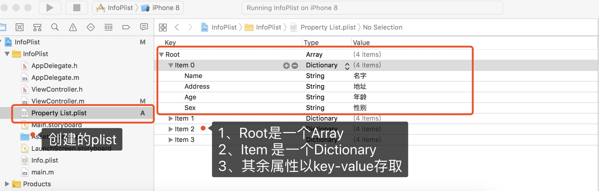

### 解析plist文件

1. plist文件以类似键值对(key - value)的形式，存储项目中的各种数据

2. plist文件支持array数组和dictionary字典两种集合类型，以及boolean布尔类型，data二进制数据类型，date日期类型，number数字类型和string字符串类型

### 创建plist文件
<pre>
/**
 获取信息
 1. 获取沙箱目录中的路径
 2. 将plist文件转换成可变数组类型
 3. 解析当前数组
 */
- (void)getInfomationFromPlist{
    NSString * filePath = [NSBundle.mainBundle pathForResource:@"Property List" ofType:@"plist"];
    NSMutableArray * array = [[NSMutableArray alloc]initWithContentsOfFile:filePath];
    NSLog(@"array---%@",array);
//    解析
    NSMutableDictionary * dic = [[NSMutableDictionary alloc]init];
    NSMutableDictionary * dic1 = [[NSMutableDictionary alloc]init];
    dic = array[0];
    dic1 = array[1];
    NSString * message = dic.description;
    NSString * message1 = dic1.description;
    NSLog(@"message---%@",message);
    NSLog(@"message1---%@",message1);
}

</pre>

### 写入plist文件
<pre>
/**
 插入信息到plist
 1. 创建字典模型对象
 2. 生产数组对象
 3. 写入到plist文件
 */
- (void)insetInformationToPlist{
    
    NSMutableDictionary * dic = [[NSMutableDictionary alloc]init];
    [dic setObject:@"Bruce" forKey:@"Name"];
    [dic setObject:@"22" forKey:@"Age"];
    [dic setObject:@"Woman" forKey:@"Sex"];
    [dic setObject:@"shanghai" forKey:@"Address"];
   
    
    NSMutableDictionary * dic1 = [[NSMutableDictionary alloc]init];
    [dic1 setObject:@"Tongle" forKey:@"Name"];
    [dic1 setObject:@"20" forKey:@"Age"];
    [dic1 setObject:@"Man" forKey:@"Sex"];
    [dic1 setObject:@"shanghai" forKey:@"Address"];
    NSMutableArray * array = [[NSMutableArray alloc]init];
    array[0] = dic;
    array[1] = dic1;
    
    NSString * filePath = [NSBundle.mainBundle pathForResource:@"Property List" ofType:@"plist"];
    [array writeToFile:filePath atomically:YES];

}
</pre>